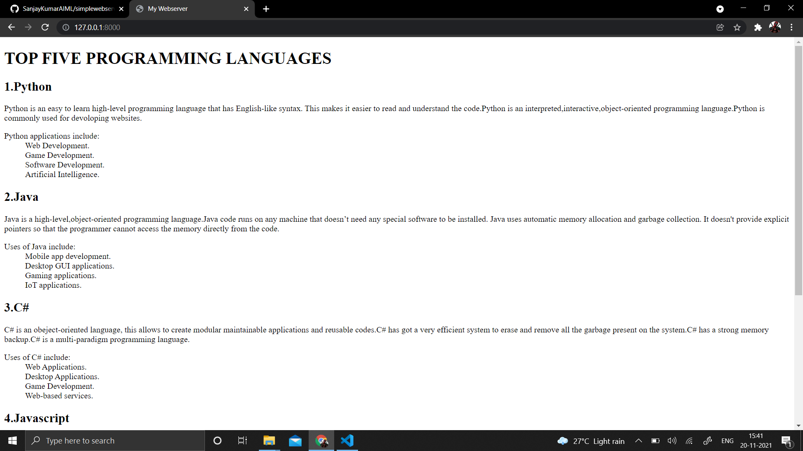
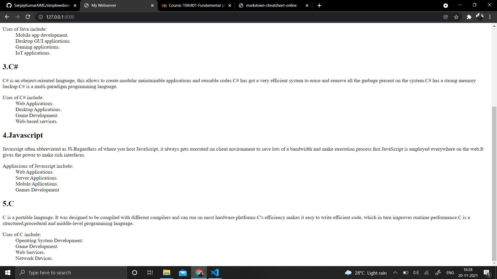
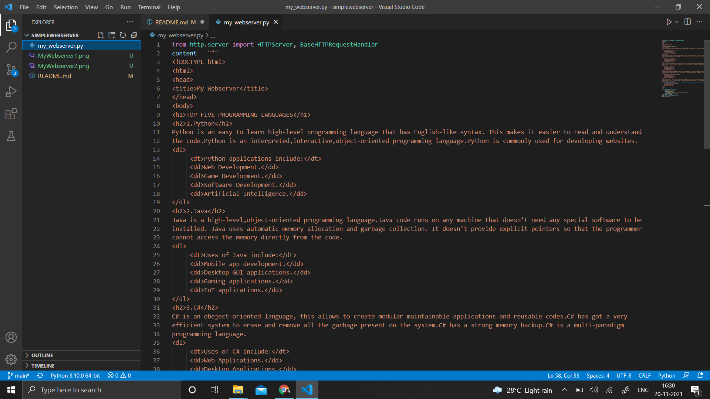
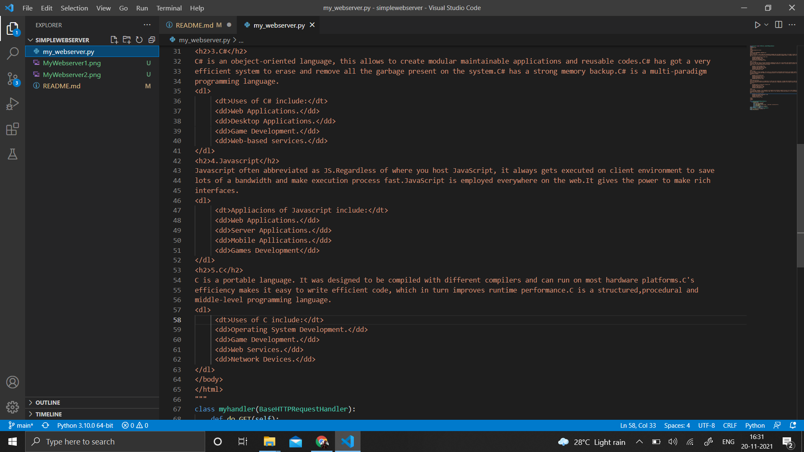
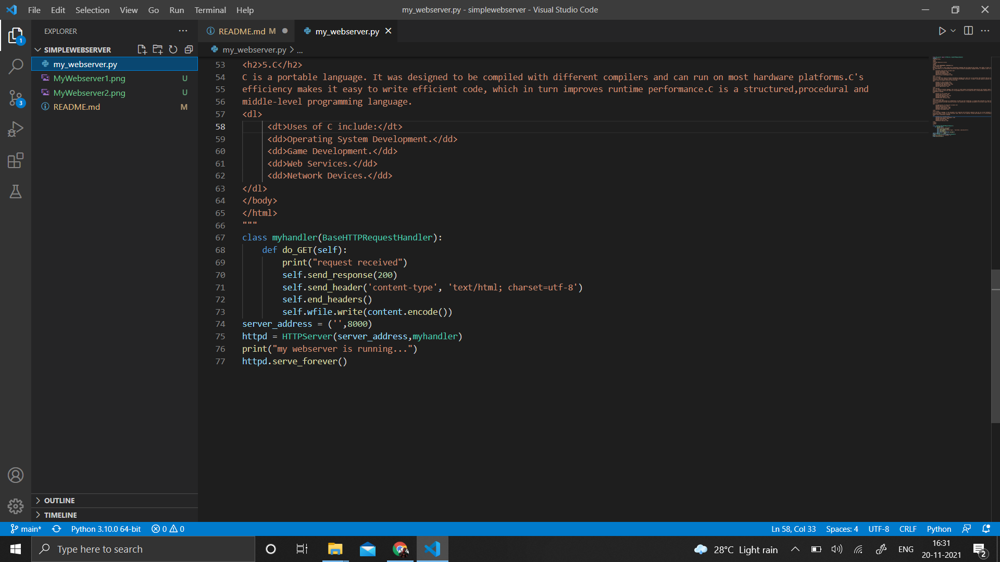

# Developing a Simple Webserver
## AIM:
To develop a simple webserver to display top five programming languages.

## DESIGN STEPS:
### Step 1: 
HTML content creation
### Step 2:
Design of webserver workflow
### Step 3:
Implementation using Python code
### Step 4:
Serving the HTML pages.
### Step 5:
Testing the webserver

## PROGRAM:
```
from http.server import HTTPServer, BaseHTTPRequestHandler
content = """
<!DOCTYPE html>
<html>
<head>
<title>My Webserver</title>
</head>
<body>
<h1>TOP FIVE PROGRAMMING LANGUAGES</h1>
<h2>1.Python</h2>
Python is an easy to learn high-level programming language that has English-like syntax. This makes it easier to read and understand
the code.Python is an interpreted,interactive,object-oriented programming language.Python is commonly used for devoloping websites.
<dl>
     <dt>Python applications include:</dt>
     <dd>Web Development.</dd>
     <dd>Game Development.</dd>
     <dd>Software Development.</dd>
     <dd>Artificial Intelligence.</dd>
</dl>
<h2>2.Java</h2>
Java is a high-level,object-oriented programming language.Java code runs on any machine that doesn’t need any special software to be 
installed. Java uses automatic memory allocation and garbage collection. It doesn't provide explicit pointers so that the programmer
cannot access the memory directly from the code.
<dl>
     <dt>Uses of Java include:</dt>
     <dd>Mobile app development.</dd>
     <dd>Desktop GUI applications.</dd>
     <dd>Gaming applications.</dd>
     <dd>IoT applications.</dd>
</dl>
<h2>3.C#</h2>
C# is an obeject-oriented language, this allows to create modular maintainable applications and reusable codes.C# has got a very 
efficient system to erase and remove all the garbage present on the system.C# has a strong memory backup.C# is a multi-paradigm
programming language.
<dl>
     <dt>Uses of C# include:</dt>
     <dd>Web Applications.</dd>
     <dd>Desktop Applications.</dd>
     <dd>Game Development.</dd>
     <dd>Web-based services.</dd>
</dl>
<h2>4.Javascript</h2>
Javascript often abbreviated as JS.Regardless of where you host JavaScript, it always gets executed on client environment to save 
lots of a bandwidth and make execution process fast.JavaScript is employed everywhere on the web.It gives the power to make rich 
interfaces.
<dl>
     <dt>Appliacions of Javascript include:</dt>
     <dd>Web Applications.</dd>
     <dd>Server Applications.</dd>
     <dd>Mobile Apllications.</dd>
     <dd>Games Development</dd>
</dl>
<h2>5.C</h2>
C is a portable language. It was designed to be compiled with different compilers and can run on most hardware platforms.C's 
efficiency makes it easy to write efficient code, which in turn improves runtime performance.C is a structured,procedural and
middle-level programming language.
<dl>
     <dt>Uses of C include:</dt>
     <dd>Operating System Development.</dd>
     <dd>Game Development.</dd>
     <dd>Web Services.</dd>
     <dd>Network Devices.</dd>
</dl>     
</body>
</html>
"""
class myhandler(BaseHTTPRequestHandler):
    def do_GET(self):
        print("request received")
        self.send_response(200)
        self.send_header('content-type', 'text/html; charset=utf-8')
        self.end_headers()
        self.wfile.write(content.encode())
server_address = ('',8000)
httpd = HTTPServer(server_address,myhandler)
print("my webserver is running...")
httpd.serve_forever()
```
## OUTPUT:
### CLIENT SIDE OUTPUT:



### SERVER SIDE OUTPUT:




## RESULT:
Thus, a simple webserver is created to display top five programming languages.